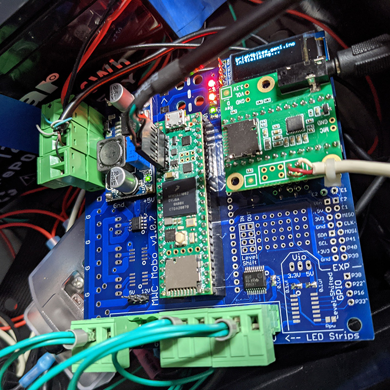

# Magic Wheelchair Motherboard

The Magic Wheelchair Motherboard is a printed circuit board that makes it much easier to add interactivity to Magic Wheelchair builds (or other interactive projects).

Features include:
* Plug-in support for Teensy 4.1 and the Teensy 4 audio audio adaptor
* 4 channels of non-blocking addressable LEDs (ws2812, neopixel, etc.) full compatible with FastLED
* Stereo sound input, processing and output including volume control, filters, polyphonic sound output, multiple channels of simultaneous sd-card playback, FFT and peak level analysis and much more.
* Level-shifted GPIO
* Full breakout of all Teensy pins
* .91" OLED Screen for debugging or status
* Multiple channels of high-current transistor driven output
* Selectable voltage (5v or 12v) for addressable LED outputs
* Pluggable connectors for VIN, LED outputs and high-current outputs
* Small prototyping area for adding additional components
* Expansion header for connecting to a daughterboard
* Support for USB host mode through the Teensy 4.1 USB header

NOTE: This board is currently in development and not all features have been tested. We plan to make these boards available to Magic Wheelchair projects and for other projects. If you are interested in obtaining a PCB or a populated board, or you are thinking about using these design files to order your own PCBs, please [email us](mailto:info@makerfx.org) to learn the current state of board testing and production.
___

MWC Motherboard prototype v1.0.7 being tested in a BrightBikes LED art bike with more than 1600 addressable LEDs

<iframe src="https://giphy.com/embed/AoEWIwNy1bjEVmdzk5" width="100%" height="100%" style="position:absolute" frameBorder="0" class="giphy-embed" allowFullScreen></iframe>

___
## History
In 2019, [we built the Bumblebee Transformer Magic Wheelchair for Alex](https://makezine.com/2019/02/08/watch-these-makers-transform-a-wheelchair-into-an-interactive-bumblebee-costume/) - that project was completed in just a few weeks, and we used the Teensy 3.6 with the Teensy 3 Audio Shield. We hand soldered protoboards for the circuits including the Teensy components, level shifters and high-current transistor outputs. Alex loved Bumblebee and Magic Wheelchair builders provided very positive feedback on the interactivity of the build. Just two weeks later, we were asked to help provide the electronics for another MWC build in Portland. Again, we created a hand-soldered protoboard. We realized that if we could make this part easier with a plug & play board for interactive MWC builds, we could help the build community significantly.

We've now worked through 7 revisions of the board, including upgrading to the Teensy 4.1 and the Teensy 4 Audio shield. We've added more functionality, and made it easier than every to get started. All our MWC build code is Open Source and available here to get builders up-to-speed quickly.

We are currently developing and testing with our BrightBikes LED art bikes project.

## Example Uses
* MakerFX Magic Wheelchair builds (includes prior generations of this circuit before the motherboard was created) [Website](http://www.makerfx.org/magic-wheelchair])
* BrightBikes - [Facebook](www.facebook.com/brightbikesorl) and [GitHub](https://github.com/makerfx/brightbikes)

## Bill of Materials
Note, not all parts are required. For example, if your build does not use high-current outputs, you don't need to populate those parts.

* PCB
  * We order using the design files here, please [email us](mailto:info@makerfx.org) to learn the current state of board testing and production.
  * If you want to purchase bare or populated boards, we are planning to make them available at some point in the future. Please [email us](mailto:info@makerfx.org) to learn the current state of board availability.

* Teensy 4.1
  * QTY 1
  * Order from [PJRC](https://www.pjrc.com/store/teensy41.html) to support the creator.
  * We install header pins, so you can order with or without pins.

* Teensy Audio Adaptor Rev D
  * QTY 1
  * Order from [PJRC](https://www.pjrc.com/store/teensy3_audio.html) to support the creator.
  * REV D is for the Teensy 4 series, make sure you get the correct revision!
  * We install header pins, so you can order with or without pins.
  * This part is not required if the project does not have audio (but why not?!)

* LM2596 DC-DC Power Supply
  * QTY 1
  * [Amazon example](https://www.amazon.com/gp/product/B07VVXF7YX/)
  * Note that footprint is very important, there are several versions of similar boards
  * We typically run these systems off 12v batteries, this part does the regulation down to 5v, then the Teensy regulator provides 3.3v
  * SET THIS PART TO 5V BEFORE TYING ITS OUTPUTS TO THE PCB!

* .91" OLED Display (i2c)
  * QTY 1
  * [Amazon example](https://www.amazon.com/MELIFE-Display-SSD1306-3-3V-5V-Arduino/dp/B08F1ZBGLN/)
  * This part is optional and can be used for debugging or status displays. They are inexpensive and very helpful

* 2 pin Plug-in Screw terminal block 5.08mm pitch
  * QTY 8 (QTY 1 for VIN, QTY 5 for optional high-current out, QTY 2 for optional addl 5v and GND out)
  * [Amazon right angle example](https://www.amazon.com/gp/product/B07317PFSH/)
  * You can use straight or right angle as your packaging dictates

* 3 pin Plug-in Screw Terminal Block 5.08mm pitch
  * QTY 4 for LED outputs
  * [Amazon right angle example](https://www.amazon.com/gp/product/B07TC4WHZJ/)
  * You can use straight or right angle as your packaging dictates

* Male & Female header for mounting Teensy and Audio Adaptor and other items
  * QTY (Approx 80 pins female and 90 pins male for base use)
  * [Amazon set example](https://www.amazon.com/gp/product/B06Y4S6G29/)

* Settings jumpers [Amazon example](https://www.amazon.com/gp/product/B07Q3CDPXF)
  * QTY 2 (QTY 1 for LED voltage output, QTY 1 for level-shifted GPIO voltage)
  * We like red as a visual reminder to manage settings!

* LEDs
  * RED VIN LED SMD 0805
    * QTY 1
    * [Mouser example](https://www.mouser.com/ProductDetail/645-599-0110-007F/)
  * Orange 5V LED SMD 0805
    * QTY 1
    * [Mouser example](https://www.mouser.com/ProductDetail/645-599-0130-007F/)
  * Green 3.3V LED SMD 0805
    * QTY 1
    * [Mouser example](https://www.mouser.com/ProductDetail/645-599-0181-007F/)
  * LED Resistors
    * ADD PART HERE
    * QTY 3

* Addressable LED output buffer
  * SN74LV245ADBR Bus Transceiver [Datasheet](http://www.ti.com/general/docs/suppproductinfo.tsp?distId=26&gotoUrl=http%3A%2F%2Fwww.ti.com%2Flit%2Fgpn%2Fsn74lv245a)
  * QTY 1
  * [Mouser](https://www.mouser.com/ProductDetail/595-SN74LV245ADBR/)
  * Technically this is optional, but if you aren't using the LEDs, this is likely not the right board for you!

* High-Current output drivers
  * TC4427ACOA713 Gate Driver 1.5A Dual [Datasheet](https://www.mouser.com/datasheet/2/268/21423F-63366.pdf)
  * QTY 3 (can be optionally populated based on number of high current outputs needed)
  * [Mouser](https://www.mouser.com/ProductDetail/579-TC4427ACOA713/)

* Battery Monitoring circuit (optional)
  * RvH
    * 4.7k resistor
  * RvL
    * 1k resistor
  * VRH
    * ?? resistor
  * VCL
    * ?? capacitor
  * Vref
    * ZTL431BFFTA 2.5V reference - [Datasheet](https://www.mouser.com/datasheet/2/115/ZTL431-432-1499165.pdf)
    * QTY 1
    * [Mouser](https://www.mouser.com/ProductDetail/621-ZTL431BFFTA/)

## Disclaimer
This is a community-driven project and only affiliated with Magic Wheelchair as we are part of the builder community. The Magic Wheelchair organization is not responsible for any of this content, the design of the board, or any software.
