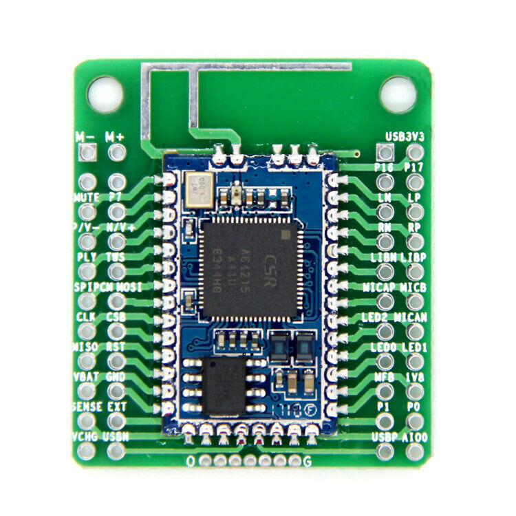
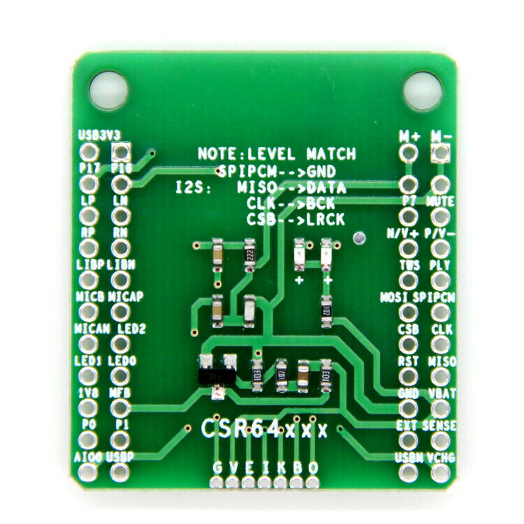
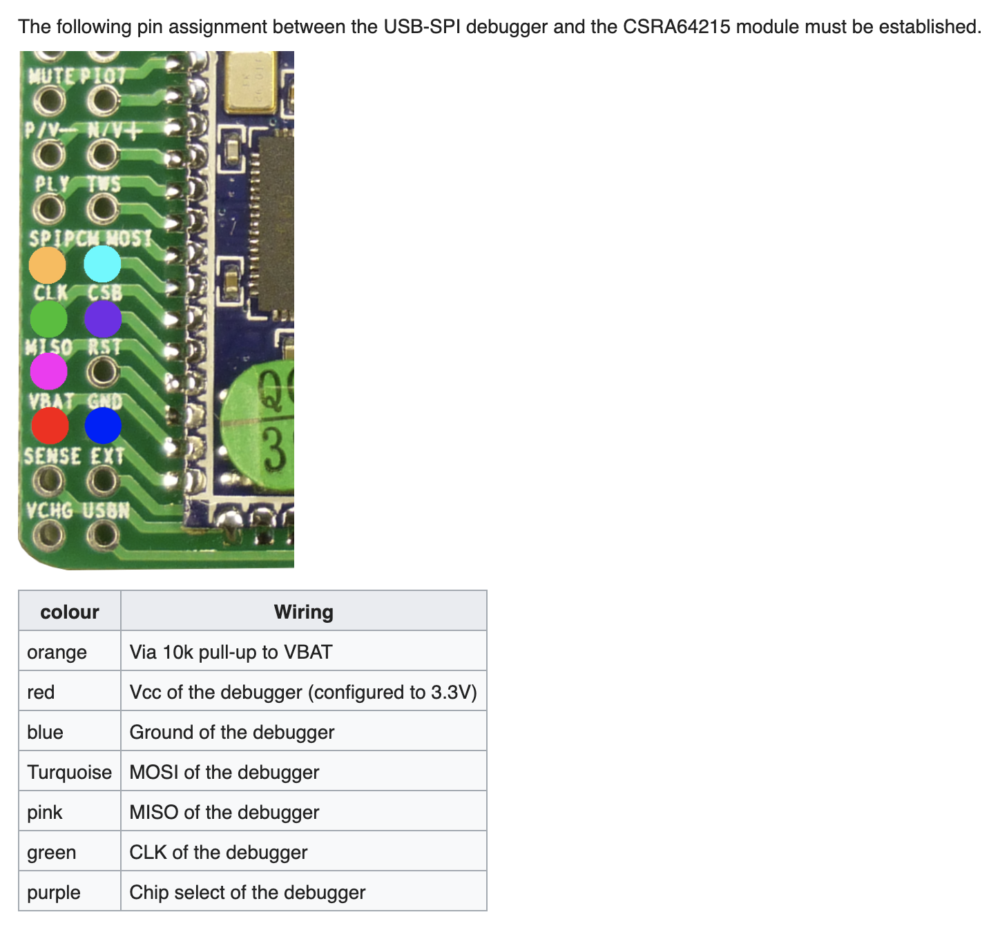
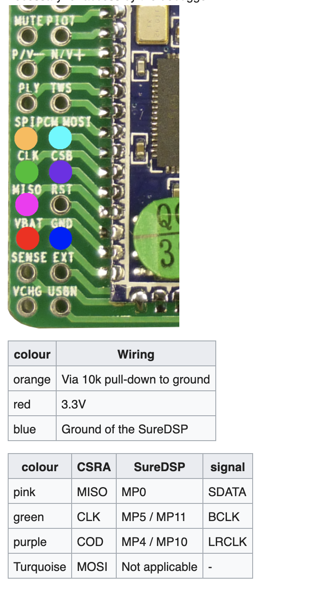

# Teensy I2S Audio Input

For interactive audio projects, we've been using an external bluetooth receiver with an analog output to run into the Teensy Audio Adaptor analog input. While this works, the path is susceptible to noise, and it adds an extra module / cables.

Ideally, we'd like to take a Bluetooth audio module such as the CSR A64215 [Datasheet](https://www.tinyosshop.com/datasheet/CSRA64215%20QFN%20Data%20Sheet.pdf) and connect it directly to the Teensy via the second I2S input which uses the [i2s2 object in the Teensy Audio System Design Tool](https://www.pjrc.com/teensy/gui/?info=AudioInputI2S2).

## Teensy I2S Input Documentation

* Pins
  * Pin 3: LRCLK Output
    * This outputs the audio system frequency, typically 44.1kHz
  * Pin 4: BCLK Output
    * (This isnt working for me currently, so I don't have confirmed output)
  * Pin 5: RX Input
  * Pin 33: MCLK Output
    * This outputs 11.2 mHz
    * Not all devices need MCLK, the CSRA64215 does not appear to need MCLK

* Audio System Design Tool Object
  * There is an [i2s2 object in the Teensy Audio System Design Tool](https://www.pjrc.com/teensy/gui/?info=AudioInputI2S2) It has no configuration. Simply declaring it enables the output clocks.

* Master / Slave
  * The Teensy is best equipped to run as the master, and you send the clocks to the slave device, and then send the resulting audio data back to the Teensy.
  * The Teensy CAN run as a slave but then the [other audio in the system will not be clocked properly and *bad things happen*](https://forum.pjrc.com/threads/53824-Teensy-3-6-I2S-Slave-Mode-Question?p=188318&viewfull=1#post188318).

* Sample Rate
  * The Teensy operates at 44.1kHz by default. [It is possible to change this, and an easy change - however it can break a number of audio system functions](https://forum.pjrc.com/threads/60272-Time-for-a-new-Audiolibrary?p=236411&viewfull=1#post236411)
  * The CSRA64215 module runs at 48kHz by default, but has a configuration to change to other frequencies.

## CSRA64215 Documentation

* [CSRA64215 Datasheet](https://www.tinyosshop.com/datasheet)
* I purchased a common breakout on eBay

* [This guide](https://translate.google.com/translate?sl=auto&tl=en&u=https://suredsp.ratz-it.de/index.php?title%3DCSRA64215) (in German, but translates well) has great pictures of this module and connections for SPI programming and I2S

* I use the [CSR USB SPI programmer](https://www.tinyosshop.com/index.php?route=product/product&product_id=876) purchased from TinySine to update the module
SPI Connections

* Uploading Firmware
  * [Guide from TinySine](https://www.tinyosshop.com/how-to-restore-bluetooth-audio-module-default-settings)
* Changing Settings
  * Note that you need a settings profile that matches the firmware. For the modules purchased from eBay, I had to start by flashing the tinysine audioB firmware, then reading / writing settings

* Connecting to Teensy
  * THE CSRA64215 has 1.8V outputs, LEVEL SHIFTER IS REQUIRED!
  * I2S connections 
